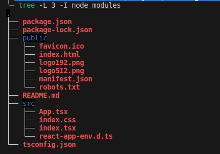

# LEARNING REACT WITH TYPESCRIPT

Project for learning react

## Examples Create app

```javascript
npx create-react-app --template typescript --use-npm app-silvestrini
cd app-silvestrini
npm start
```

### Scaffold after install



Here's a description of each file in the given React app directory tree:

- **package.json**: This file is a standard file in Node.js projects that includes metadata about the project, including dependencies, scripts, and other configurations needed to run the project. It is used by npm (Node Package Manager) to manage the project's dependencies and scripts.

- **package-lock.json**: This file is automatically generated by npm to lock down the version of every package's dependencies. It ensures that the same versions of dependencies are installed across different machines, providing consistent builds.

- **public/**: This directory contains static assets that are publicly accessible and typically served as-is to the client. Files like `favicon.ico`, `index.html`, images (`logo192.png`, `logo512.png`), `manifest.json`, and `robots.txt` are usually found here.

  - **favicon.ico**: The icon displayed in the browser's tab or window.
  - **index.html**: The HTML file that serves as the entry point for the React application.
  - **logo192.png**, **logo512.png**: Images used as icons or logos for the application.
  - **manifest.json**: A JSON file that provides metadata used when installing the web application on a mobile device's home screen.
  - **robots.txt**: A text file used to instruct web crawlers and other automated agents about the site's pages to crawl or not to crawl.

- **README.md**: This is a markdown file that typically contains information about the project, how to set it up, usage instructions, and other relevant details for developers or users.

- **src/**: This directory contains the source code for the React application.

  - **App.tsx**: The main component file where the application logic is typically defined. This is where the React application is constructed.
  - **index.css**: CSS file to style the application, often imported in `index.tsx`.
  - **index.tsx**: The entry point of the React application. It renders the main `App` component into the DOM.
  - **react-app-env.d.ts**: A TypeScript declaration file that provides global type definitions for the React application.
  
- **tsconfig.json**: The TypeScript configuration file that specifies how the TypeScript compiler should compile the project, including settings like target version, module type, and compilation options.

## References

[Official Doc](https://react.dev/learn)
[Create App](https://create-react-app.dev/docs/getting-started)
